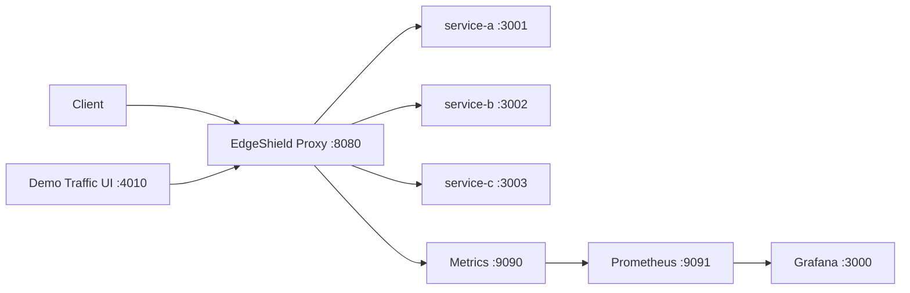

# EdgeShield

EdgeShield is a C++ traffic gateway that sits in front of backend services and handles common edge concerns in one place: HTTP forwarding, WebSocket upgrades, load balancing, health checks, caching, rate limiting, circuit breaking, and Prometheus metrics.

The project is designed as a practical systems and networking project. It includes a Docker Compose environment with three demo backend services, Redis-backed rate limiting, Prometheus, Grafana, and a small traffic generator UI for exercising the proxy.

## What It Includes

- C++ reverse proxy built with Boost.Asio and Boost.Beast
- HTTP and WebSocket forwarding
- Round-robin backend selection
- Active backend health checks
- Response caching for configured GET routes
- Fixed-window rate limiting with optional Redis storage
- Circuit breaker behavior for failing backends
- Prometheus metrics endpoint
- Grafana dashboard provisioning
- Browser-based demo traffic interface
- Docker and Kubernetes deployment files

## Architecture



## Run With Docker

```bash
docker compose up --build
```

Open:

- Proxy: `http://localhost:8080/hello`
- Demo traffic UI: `http://localhost:4010`
- Metrics: `http://localhost:9090/metrics`
- Prometheus: `http://localhost:9091`
- Grafana: `http://localhost:3000`

Grafana credentials:

```text
admin / edgeshield
```

## Demo Traffic

Open the demo traffic interface:

```text
http://localhost:4010
```

Use it to send:

- mixed traffic
- repeated cache requests
- load-balancing bursts
- rate-limit bursts
- custom paths through the proxy

Traffic from this interface goes through EdgeShield on port `8080`, so Prometheus and Grafana update from real proxy activity.

## Local Build

On Ubuntu or WSL:

```bash
sudo apt-get update
sudo apt-get install -y build-essential cmake libboost-all-dev nlohmann-json3-dev libssl-dev
cmake -S . -B build -DBUILD_TESTING=ON
cmake --build build -j
ctest --test-dir build --output-on-failure
```

Run the proxy locally:

```bash
./build/core-proxy/edgeshield-proxy config/edgeshield.json
```

Start demo backends separately from `demo-backends` when running without Docker.

## Configuration

The main runtime config is `config/edgeshield.json`.

Docker uses `infra/docker/edgeshield.docker.json` so service names resolve inside the Compose network.

Important sections:

- `proxy`: listener ports, TLS settings, worker count, metrics port
- `redis`: optional Redis-backed rate-limit storage
- `backends`: upstream services and health paths
- `routes`: backend pool, cache, rate-limit, retry, and circuit-breaker policy

## Repository Layout

```text
core-proxy/       C++ proxy source, headers, tests, and Dockerfile
demo-backends/    Node demo backend services
demo-traffic/     Browser UI and API for generating traffic
config/           Local runtime configuration
infra/            Docker, Kubernetes, Prometheus, and Grafana files
compose.yaml      Full local stack
```

## Notes

This is a learning-focused gateway project rather than a production ingress replacement. It keeps the control surface small and exposes runtime visibility through Prometheus and Grafana.
